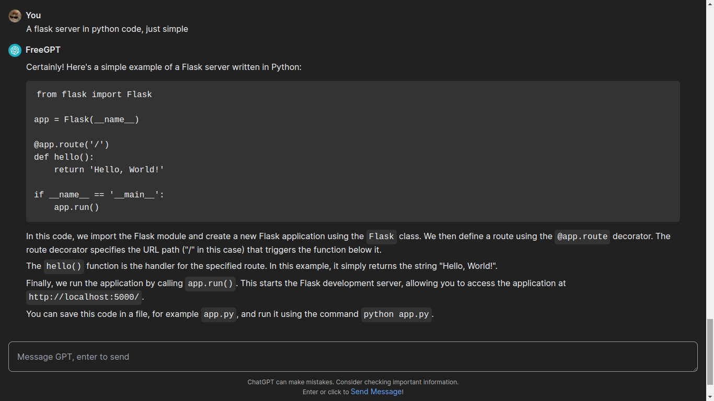

## ChatGPT Clone
This is a full-stack project I made using Next.js. This project is a complete working ChatGPT clone. I designed the whole GPT UI with Tailwind CSS myself. Here's what I used for this:
- Tailwind CSS: design
- Next.js: library
- Remark: Markdown rendering

Specifically, my own library:
- [FreeGPT.js](https://freegpt.js.org/) : the stable free library for ChatGPT

## Features
- Free, unlimited messages & Chats
- Markdown rendering of links and headings
- A good feel
- **(NEW)** Code Blocks Styling - just design :P
- **(NEW)** Dark Mode - because why not!

Here are some screenshots too (not latest :P):





Have a try and a star. You can use my ChatGPT UI but make sure to thank me!

## Running
```bash
npm install
npm run dev
```